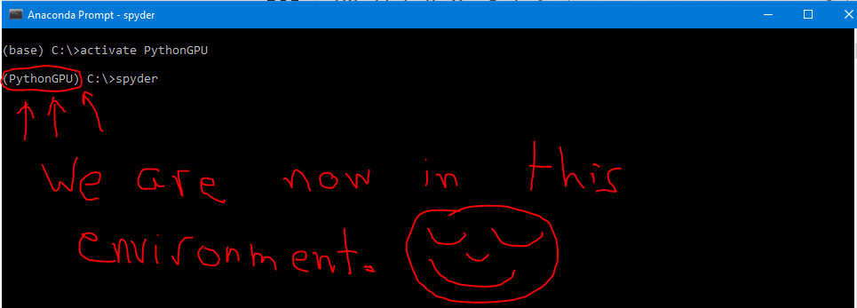
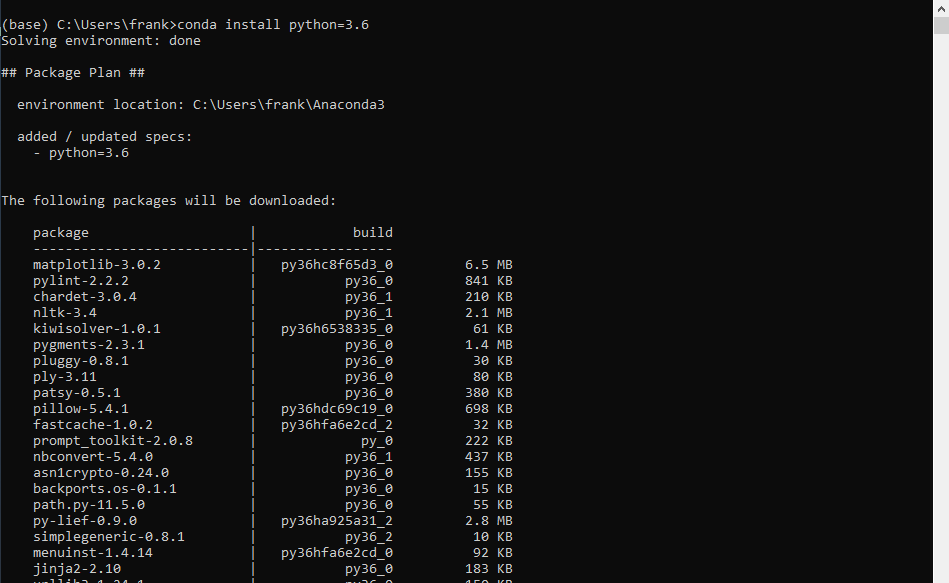
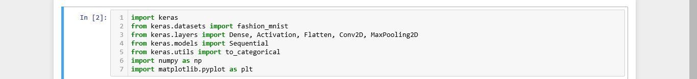
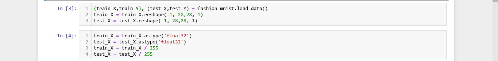
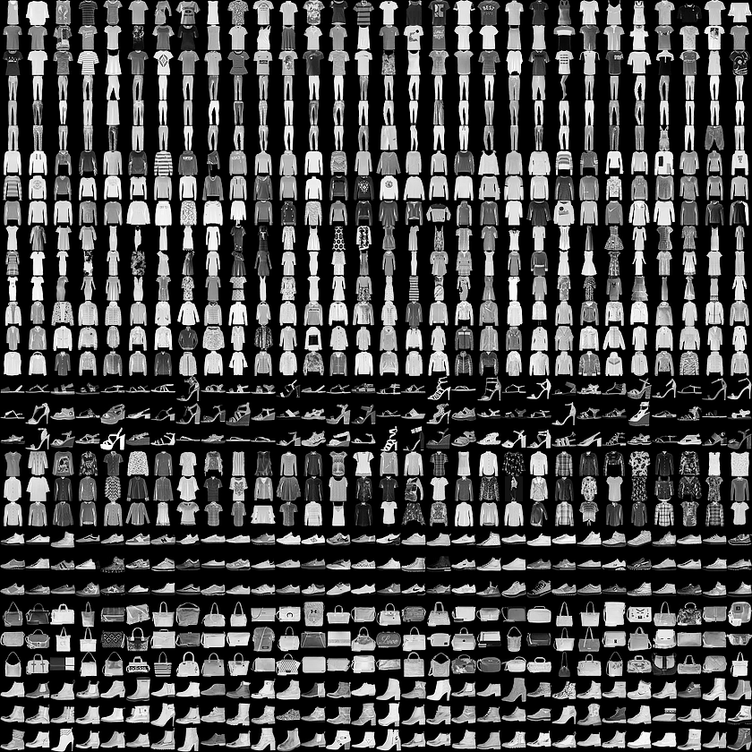
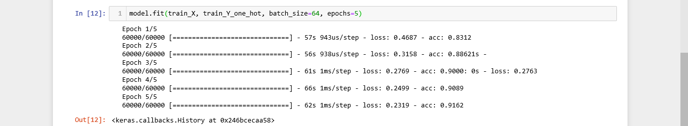
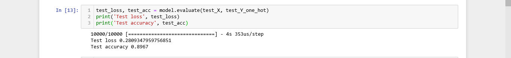
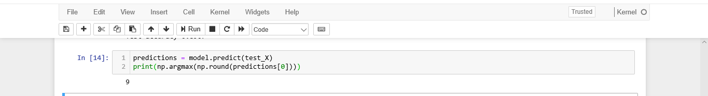
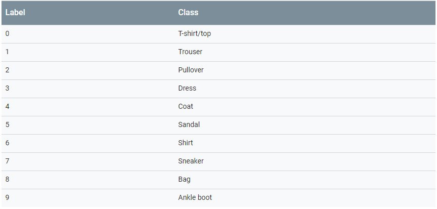
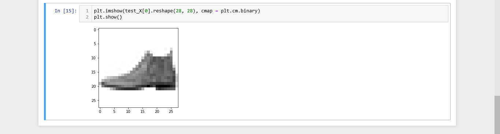

# ImageClassification
Used MNIST database with almost 70,000 images to classify images according to the product label. Accuracy Achieved - 89.67%

## Steps to install GPU on Anaconda with Keras and Tensorflow
1. Open Anaconda Console
2. Type - "conda create --name PythonGPU"
3. After installtaion, type - "activate PythonGPU"
4. After activating, the venv will be PythonGPU as shown below

5. After getting into the PythonGPU environment, type - "conda install -c anaconda keras-gpu"

6. After installation, type - "jupyter" for coding.

## Steps to install Keras and Tensorflow in CPU in Anaconda
1. Open Anaconda Console
2. Type "conda create --name PythonCPU"
3. After installtaion, type - "activate PythonCPU"
4. Follow same commands as in GPU after getting into the virtual env of CPU

## Code
1. Importing the neccessary modules.

2. After importing modules, import the data

3. The Fashion MNIST data set contains 70,000 grayscale images in 10 categories. The images show individual articles of clothing at low resolution (28 by 28 pixels), as seen here:

4. The reshape commands changes the dimesnsipns of the data set.
5. After uploading the data, it's time to run the epochs.
6. PRO-TIP. If you are using a NVIDIA graphic card, then only use GPU otherwise use CPU with maximum 10 epochs.

7.The epochs will take roughly 2-3 minutes to run. (There are only 5 Epochs in this case as it was on GPU)
8. The accuracy increases with increasing epochs.
9. The Test Accuracy comes out to be

10. The classification comes out to be 9, which matches with ankle boot,

10. And the output is the correct classification of our data

